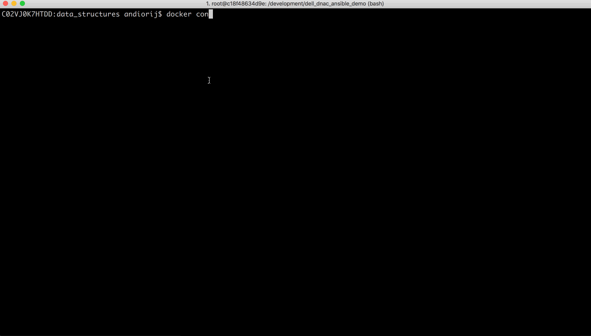
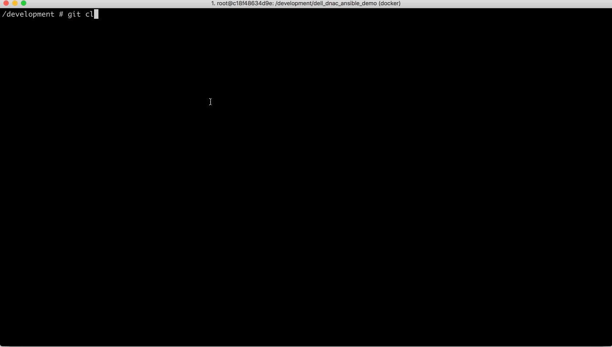
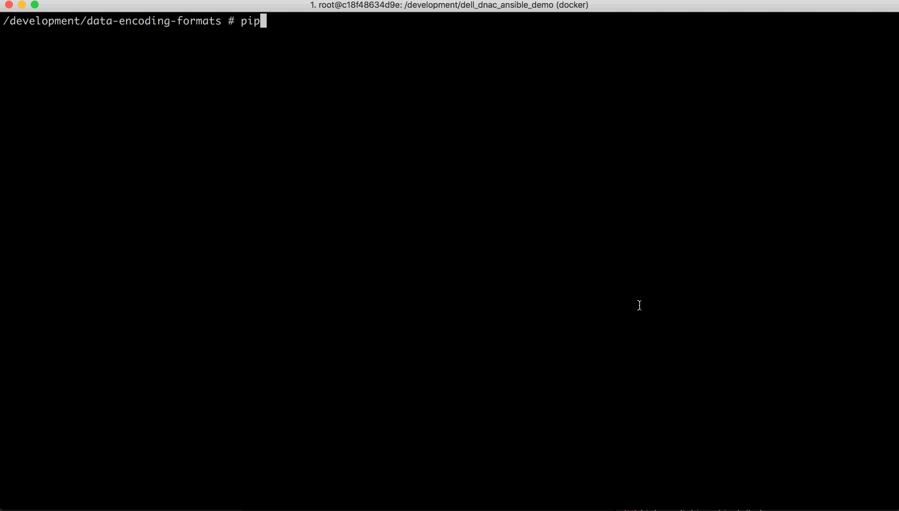

# Getting Setup
This lab will utilize a docker container as a development environment.  This avoids the worries about installing conflicting python packages or differences in the local environments of each workstation.

## Using a Container

Learn more about containers:

[WWT Programmability Lab: Containers](https://labs-dev.wwtlab.net/lab-guides/programmability_foundations_lab/containers/1_containers_index.html)

**PREREQUISITES**
- install docker desktop application


To start a new docker container based on one of our existing images execute this command:

|variable|value|
|-|-|
|local_folder|~/development|
|container_folder| /development|
|container_name|wwt-dev|
|docker_image|wwt01/alpine-network-dev|

```shell
docker container run -itv \
{{local_folder}}:{{ container_folder}} \
--name {{ container_name }} {{ container_image }}
```
You should now be at the `bash` shell of your docker container in a directory named /development.  This directory was mapped to a local directory



## Cloning the repo

Now that you have launched your docker container, you can clone the repository down to your `/development` folder (which is mapped to your host machine).

```shell
git clone https://github.com/wwt/data-encoding-formats.git
```



## Installing the Required Python Libraries
All of the required python libraries are included in the `requirements.txt` file in the root of our project directory.

To intall these packages we will use the `pip` installer with the `-r` switch.

```shell
pip install -r requirements.txt
```



[Lab 1](./yaml-lab-1.md)

[Home](../README.md)